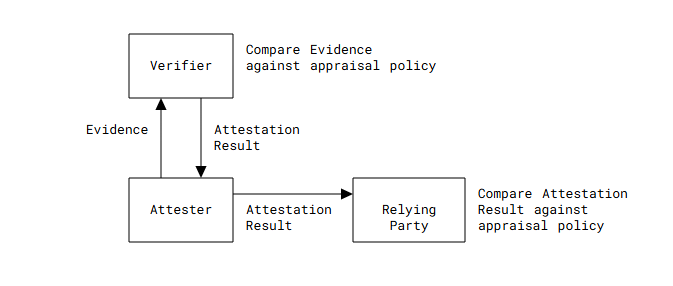
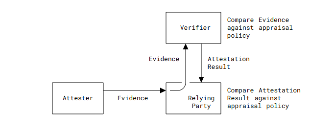
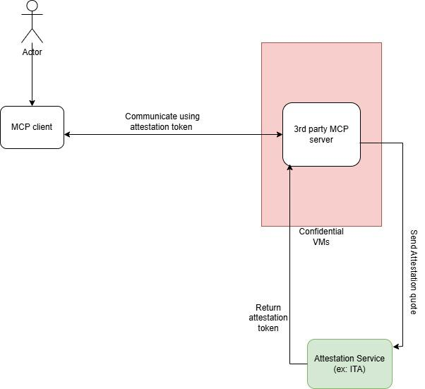
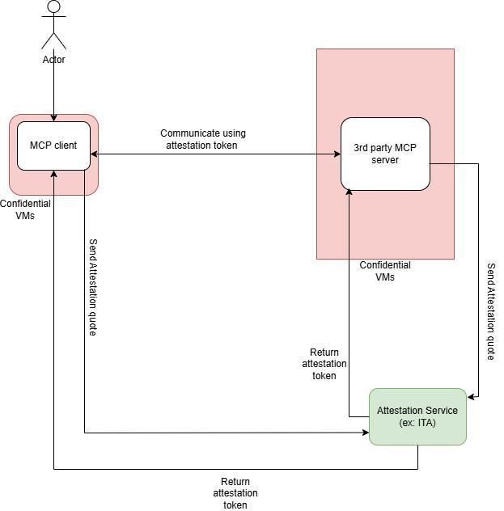
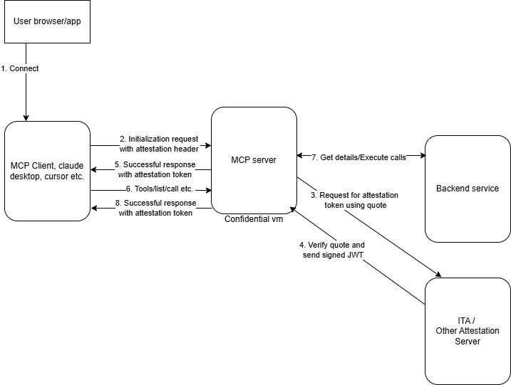
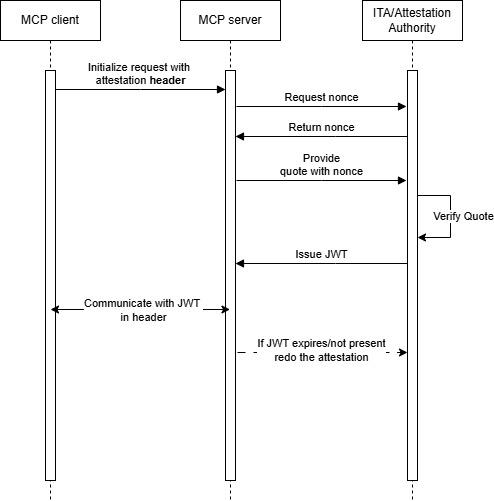
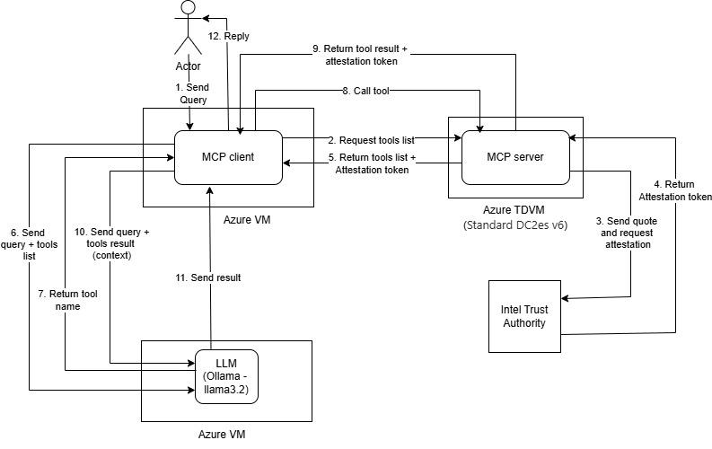
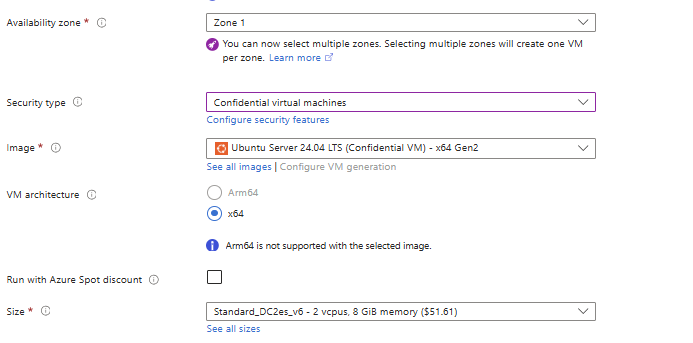
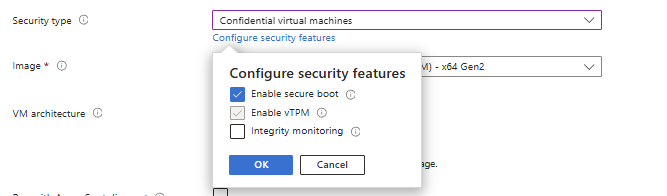
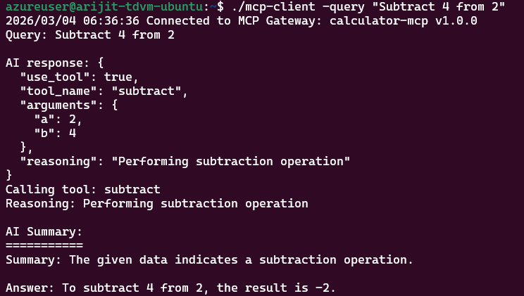

# Runtime Security and Isolation

## **Overview: Runtime Isolation**

This cookbook provides hands-on guidance for isolating and securing MCP
runtime environments at Runtime.

## **Core Principles of Enterprise MCP Security**

-   **Prefer remote over local:** Run MCP server via streamable HTTP
    > over local deployment via STDIO in an enterprise environment. In
    > enterprise deployments, STDIO-based local MCP servers create
    > operational blind spots. They run in local environments where
    > centralized logging, monitoring, and policy enforcement are either
    > absent or inconsistent. When STDIO is unavoidable (developer CLI
    > tools, local coding assistants), apply OS-level sandboxing
    > (bubblewrap on Linux, seatbelt on macOS) and treat the local
    > environment as untrusted. Allocate dedicated resources and enforce
    > filesystem restrictions even for local deployments

-   **Sandbox isolation**: Execute tools in a sandbox or restricted
    > environment when possible

-   **Label-Based Control:** Implement Mandatory Access Control (MAC)
    > where every object has a classification and every agent session
    > has a clearance ceiling enforced externally to the agent.

-   **Principle of Least Agency:** Do not make tools overly permissive;
    > execute them in sandboxed environments with strict resource
    > limits

-   **Hardware-Level Trust for sensitive MCP servers:** Run sensitive
    > MCP servers in Trusted Execution Environments (TEEs) and use
    > remote attestation to verify trustworthiness before
    > interaction

## **Related Security Framework Resources**

Enterprise environments must select isolation technologies based on the
specific risk profile of the workload---ranging from lightweight OS
primitives to high-assurance hardware isolation

-   Standard Linux Security Features

    -   Linux User Management

    -   Linux File Access Control

    -   chroot

    -   Namespace

    -   Cgroups

-   Security Modules and Kernel Hooks

    -   Landlock

    -   Seccomp

    -   AppArmor

    -   SELinux

    -   Firejail

-   Process-level Container Runtime

    -   bubblewrap (Linux)

    -   Seatbelt (macOS)

    -   Endpoint Security library (macOS)

-   Cloud Environments

    -   Amazon Bedrock AgentCore Runtime

    -   Google Cloud Run

-   Full Container and Runtime Isolation

    -   Docker

    -   gVisor

    -   Sysbox

    -   Kubernetes

        -   Admission Control

        -   Pod Security Context

        -   Node Isolation

-   Virtual Machines

    -   KVM/QEMU

    -   Kata Containers

    -   Firecracker

    -   KubeVirt

-   Confidentiality & Integrity /Zero Trust

    -   Trusted Execution Environments

## Types of Resources to Manage/Isolate/Control

1.  File system and individual file access

2.  Network access

3.  Computing resources like CPU/memory

4.  OS information

It is a standard security practice to allocate resources for remotely
managed runtime, while it is equally critical to consider resources
management for local deployment of MCP servers, e.g., STDIO.

## Cookbooks for Resource Management/Isolation/Control

### Docker Container

Start MCP server in a docker container is simple, which automatically
uses Linux namespaces and cgroups to achieve isolation and manage resources:

```bash
docker run -i --rm container_image_name
```

Commonly used arguments:

| Flag                              | Purpose                                                          |
|-----------------------------------|------------------------------------------------------------------|
| `-i`                              | Enables STDIN so the MCP server can use STDIO for input/output   |
| `-e ENV_VAR_X=XYZ`               | Sets an environment variable (e.g., GitHub token, API secret)    |
| `-v /host/path:/container/path`   | Mounts a host directory as writable inside the container         |
| `-v /host/path:/container/path:ro`| Mounts a host directory as read-only inside the container        |
| `--network none`                  | Disables all network access (host bridge is enabled by default)  |
| `--cpus 2`                        | Limits container to 2 CPUs                                       |
| `-m 2GB`                          | Limits container memory to 2 GB                                  |

Enterprise-hardened example — for MCP servers accessing production data, combine isolation flags:

```bash
docker run -i --rm \
  --runtime=runsc \
  --read-only \
  --cap-drop=ALL \
  --security-opt=no-new-privileges:true \
  --network none \
  --cpus 2 -m 2GB \
  --user mcpuser \
  -e GITHUB_TOKEN="${GITHUB_TOKEN}" \
  -v /data/project:/data/project:ro \
  my-mcp-server:latest
```

A minimal Dockerfile for an MCP server with non-root user:

```dockerfile
FROM python:3.11-slim-bookworm

# Create non-root user
RUN groupadd -r mcpuser && useradd -r -g mcpuser -d /home/mcpuser -m mcpuser

# Install dependencies
RUN pip install --no-cache-dir mcp httpx

# Copy server code
COPY server.py /app/server.py

WORKDIR /app
USER mcpuser
ENTRYPOINT ["python", "server.py"]
```

### gVisor based Container runtime for MCP servers

[gVisor](https://gvisor.dev/) provides a sandboxed environment for containers by
intercepting system calls and filtering them through a userspace "application kernel"
written in Go. It integrates with Docker as an OCI-compliant runtime (runsc), replacing
the standard host kernel interaction with a restricted interface that prevents a
compromised container from accessing the underlying host operating system.

**Running GitHub MCP server in gVisor hardened Docker image**

1. **Install [runsc](https://gvisor.dev/docs/user_guide/install/) and configure gVisor as Docker runtime**

   ```bash
   (
     set -e
     ARCH=$(uname -m)
     URL=https://storage.googleapis.com/gvisor/releases/release/latest/${ARCH}

     wget ${URL}/runsc ${URL}/runsc.sha512 \
          ${URL}/containerd-shim-runsc-v1 ${URL}/containerd-shim-runsc-v1.sha512

     sha512sum -c runsc.sha512 containerd-shim-runsc-v1.sha512
     rm -f *.sha512
     chmod a+rx runsc containerd-shim-runsc-v1
     sudo mv runsc containerd-shim-runsc-v1 /usr/local/bin
   )
   ```

2. **Configure Docker runtime**

   ```bash
   sudo runsc install
   sudo systemctl restart docker
   ```

3. **Create a hardened MCP image**

   ```dockerfile
   # Use a slim, stable base image
   FROM python:3.11-slim-bookworm

   # Create a dedicated non-root user
   RUN groupadd -r mcpuser && useradd -r -g mcpuser -d /home/mcpuser -m mcpuser

   # Install the popular GitHub MCP server
   RUN pip install --no-cache-dir mcp-server-github

   # Set security context
   WORKDIR /home/mcpuser
   USER mcpuser
   ENTRYPOINT ["mcp-server-github"]
   ```

4. **Build image**

   ```bash
   docker build -t secure-github-mcp:v1 .
   ```

5. **Launch with enterprise-grade isolation**

   ```bash
   docker run -i --rm \
     --runtime=runsc \
     --read-only \
     --cap-drop=ALL \
     --security-opt=no-new-privileges:true \
     --network none \
     --cpus 1.0 \
     -m 512MB \
     -e GITHUB_PERSONAL_ACCESS_TOKEN="${GITHUB_TOKEN}" \
     secure-github-mcp:v1
   ```

### Linux User Management & File Access Control (without container/VM)

1.  Create a dedicated user for MCP server processes:

> sudo useradd -s /sbin/nologin -m -c \"MCP Server\" mcp

2.  The user has read-write access to its home directory /home/mcp. For
    > example, it can write notes in text files as memory, checkout
    > github repos, and install software such as uv for Python
    > environments.
3.  Share files that are read-only to the mcp user by creating a
    > directory with other permission to read and execute but is not
    > owned by mcp user.
4.  Share files and allow MCP server to edit, copy files into /home/mcp
    > and assign mcp as the owner:

> chown mcp:mcp /home/mcp/sharedfiles

5.  Launch the local MCP server with mcp user

> sudo -u mcp-server-proc

6.  Further file system access, e.g., whitelist executables, can be done
    > through chroot environment

### Linux Namespace & Control Groups (without container/VM)

-   Network access can be managed through Linux network namespace:
-   Execute the MCP server process in a new network namespace without
    > existing host networks, e.g., Internet

> unshare \--user \--net mcp-server-proc

-   Create and configure Linux network namespaces for the MCP server and
    > launch the MCP process with ip netns exec
-   CPU/memory access can be managed by Linux Control Groups (cgroups)
-   Launch the MCP server process with only CPU 0 and 1:

> systemd-run \--scope -p AllowedCPUs=0,1 mcp-server-proc

### Firecracker

-   Use Jailer to start firecracker

-   Specify CPU/memory limit when setting up the microVM

> curl \--unix-socket \"\${API_SOCKET}\" -i \\
>
> -X PUT \"http://localhost/machine-config\" \\
>
> -H \"Content-Type: application/json\" \\
>
> -d \'{
>
> \"vcpu_count\": 1,
>
> \"mem_size_mib\": 512,
>
> \"ht_enabled\": false
>
> }\'

-   Attach (or not) network interfaces to a microVM

> curl \--unix-socket \"\${API_SOCKET}\" -i \\
>
> -X PUT \"http://localhost/network-interfaces/iface_1\" \\
>
> -H \"Content-Type: application/json\" \\
>
> -d \'{
>
> \"iface_id\": \"iface_1\",
>
> \"host_dev_name\": \"fctap1\",
>
> \"guest_mac\": \"06:00:c0:a8:34:02\"
>
> }\'

-   Attach (or not) read-only data drives

> curl \--unix-socket \"\${API_SOCKET}\" -i \\
>
> -X PUT \"http://localhost/drives/data_drive\" \\
>
> -H \"Content-Type: application/json\" \\
>
> -d \'{
>
> \"drive_id\": \"data_drive\",
>
> \"path_on_host\": \"/data/project.data.ext4\",
>
> \"is_root_device\": false,
>
> \"is_read_only\": true
>
> }\'

-   Setup rate limiter for network and block storage (use HTTP PUT for
    > pre-boot setup)

> curl \--unix-socket \"\${API_SOCKET}\" -i \\
>
> -X PATCH \'http://localhost/network-interfaces/iface_1\' \\
>
> -H \'Accept: application/json\' \\
>
> -H \'Content-Type: application/json\' \\
>
> -d \'{
>
> \"iface_id\": \"iface_1\",
>
> \"rx_rate_limiter\": {
>
> \"bandwidth\": {
>
> \"size\": 1048576, // 1 MB limit
>
> \"one_time_burst\": 10485760, // 10 MB burst
>
> \"refill_time\": 1000
>
> },
>
> \"ops\": {
>
> \"size\": 2000,
>
> \"refill_time\": 1000
>
> }
>
> }
>
> }\'

-   Setup environment variables using MMDS

> curl \--unix-socket \"\${API_SOCKET}\" -i \\
>
> -X PUT \"http://localhost/mmds\" \\
>
> -H \"Content-Type: application/json\" \\
>
> -d \'{
>
> \"MY_ENV_VAR\": \"first message\",
>
> \"DB_HOST\": \"172.10.0.1\",
>
> \"APP_ENV\": \"testing\"
>
> }\'

-   Selectively share files/directories between host and microVM via
    > NFS/Samba/sshfs

## Agent and MCP isolation with Confidential Computing & Trusted Execution Environments 

## **1. Introduction**

**MCP (Model Context Protocol)** is an Open protocol from Anthropic (Nov
2024) that standardizes how LLM applications connect to external data
sources and tools.

**Confidential computing & TEEs**

-   Trusted Execution Environments (TEEs) like Intel TDX and AMD SEV
    > protect code and data in use.

-   TEEs prevent access by administrators, compromised software, network
    > attackers, and tampered firmware; only the processor can view
    > plaintext.

-   Modern CPUs/GPUs commonly include TEE support.
-   

**Remote attestation and attestation providers**

-   Remote attestation proves that code runs on genuine, uncompromised
    > TEE hardware.

-   An attestation provider (e.g., Intel Trust Authority,
    > Azure/Microsoft Attestation, Google Cloud Attestation, or DIY)
    > validates platform evidence and issues cryptographically signed
    > tokens (JWTs).

-   These tokens let MCP components, key management, and identity
    > services verify an environment's trustworthiness before sharing
    > sensitive data or credentials.

## **2. MCP Client-Server Communication: An Overview**

MCP is a standard protocol that lets AI applications (clients) access
data and tools (servers) through a consistent interface---similar in
role to USB for devices or HTTP for the web.

**Key features:**

-   *Client-server model*: Clients (LLMs/agents) connect to servers that
    > expose resources, tools, or APIs.

-   *Standard messages*: Uniform request/response formats for data
    > access, tool invocation, and resource management.

-   *Flexible transport*: Supports local integrations (stdin/stdout) and
    > remote connections (HTTP with Server-Sent Events).
-   

**Core concepts:**

-   *Resources*: Readable data (files, DB records, API responses)
    > identified by URIs; can be text or binary.

-   *Prompts*: Templated instructions or starter contexts servers
    > provide to streamline common tasks.

-   Tools: Invokable functions that perform operations or return dynamic
    > results (distinct from static resources).

-   *Sampling*: Server-initiated requests for the client to generate
    > completions, enabling agentic behaviors and multi-step workflows.

## **3. RATS (Remote ATtestation procedureS) Architecture**

RATS (IETF RFC 9334) defines a standard model for remote attestation in
confidential computing. It specifies roles, terminology, and interaction
patterns to establish cryptographic trust in a remote system by
evaluating evidence about its hardware and software state. RATS solves
the problem of verifying a system's execution environment
remotely---without physical access---so other systems can decide whether
to trust it.

*3.1. Key Roles*

-   **Attester:** Produces Evidence about its platform and runtime
    > (e.g., TDX/SEV quotes).

-   **Verifier:** Evaluates Evidence (using policies, endorsements, and
    > reference values) and produces Attestation Results.

-   **Relying Party:** Consumes Attestation Results to decide whether to
    > trust the Attester for a given action.

-   **Relying Party Owner:** Configures the Relying Party's appraisal
    > policy (typically an administrator).

-   **Verifier Owner:** Configures the Verifier's appraisal policy and
    > trusted inputs (typically an administrator).

-   **Endorser:** Provides Endorsements (e.g., manufacturer keys) that
    > help Verifiers authenticate Evidence.

-   **Reference Value Provider:** Supplies expected reference values
    > (trusted measurements or claims) that Verifiers use to appraise
    > Evidence.

*3.2. Remote Attestation Deployment Patterns*

IETF RATS has two deployment patterns.

**Passport Model:**

-   *Concept:* Attester obtains a signed token from a trusted local
    > authority and presents that token to Relying Parties to assert
    > identity/claims.

-   *Flow:* Attester → Authority/Verifier issues token → Attester
    > presents token → Relying Party validates.

-   *Properties:* Attester-held, portable, authority-bound.

-   *Pros:* Low-latency verification, useful offline or across domains.

-   *Cons:* Harder revocation/freshness control; requires Relying
    > Parties to trust the issuer.

-   *Typical use:* Cross-organization attestation and client-side
    > presentation of platform claims.

-   *Reference:* RFC 9334 §5.1



**Background Check Model:**

-   *Concept*: Relying Party forwards Attester‑provided Evidence to a
    > Verifier, which appraises it and returns an Attestation Result;
    > the Relying Party then applies its own policy to that result.

-   *Flow*: Attester → Relying Party (forwards Evidence) → Verifier
    > (appraises) → Relying Party (evaluates Attestation Result).

-   *Properties*: Relying Party treats Evidence as opaque; verification
    > is centralized at the Verifier.

-   *Pros*: Centralized, consistent appraisal; real‑time freshness and
    > easier revocation; simpler Relying Party logic.

-   *Cons*: Added latency and dependency on an online Verifier;
    > potential verifier bottleneck and targeted attack surface.

-   *Typical use*: Environments that prefer centralized trust and live
    > verification (e.g., enterprise services, dynamic access control).

-   *Reference*: RFC 9334 §5.2.



**MCP Protocol Extensions**

-   *Focus*: This extension targets the Passport model as the primary
    > attestation pattern.

-   *Why*: Passport tokens enable reuse, lower latency, reduced verifier
    > load, better scaling, and lower cost.

-   *Background Check*: Not the default, but can be supported when
    > needed.

-   *When to use Background Check*: per-request verification,
    > highest-security deployments, or when a client mandates a specific
    > attestation provider.

-   *Implication*: Default workflows assume reusable tokens; add
    > Background Check only for scenarios that require live, per-client
    > verification.

## **4. Security Risks Mitigated**

4.1. *Inadequate data protection & confidentiality (MCP‑T5)* : TEEs
encrypt memory and isolate runtime, preventing extraction of in‑use
secrets (API keys, tokens) via host OS or memory dumps.

*Note:* Attestation shows the server hasn't been modified to exfiltrate
secrets but does not enforce secure secret handling in application code.

4.2. *Missing integrity/verification controls (MCP‑T6):* Measurement
verification and attestation prove the VM/container and deployed
components match expected measurements, assuring clients they talk to
untampered servers.

-   

4.3. *Trust‑boundary and privilege failures (MCP‑T9):* Running clients
and servers in TEEs removes the host OS, firmware, and hypervisor from
the trust boundary, mitigating privileged‑host attacks against MCP
components.

-   

4.4. *Improper multitenancy:* Per‑tenant TEEs provide cryptographic
isolation so one tenant's server cannot read another's memory on the
same physical host.

*Caveat:* isolation reduces direct memory attacks; side‑channel risks
require additional mitigations.

## **5. Deployment Scenario**

The deployment of components in an MCP Client-Server architecture in the
context of Confidential Computing could involve two different deployment
scenarios.

**Scenario 1 - MCP Server Attestation (Servers in TEEs):**

-   *Description:* MCP servers run inside TEEs; clients verify the
    > server's attestation before interacting or sharing sensitive data.

-   *Flow:* Client requests/validates attestation → if trusted, client
    > proceeds to call tools or share data.

-   *When used:* Clients that expose sensitive resources (e.g., Roots
    > access to local filesystem) or need assurance that a server won't
    > exfiltrate shared secrets.

-   *Benefits:* Ensures data sent to the server is processed in a
    > hardware-isolated environment; reduces risk from a compromised
    > host or hypervisor.

-   *Caveats:* Trust depends on correct attestation validation and token
    > freshness; application-level secret handling still matters.



> Fig. MCP servers being attested

**Scenario 2 - Mutual Attestation (Clients and Servers in TEEs):**

-   Description: Both MCP clients and servers run in TEEs and perform
    > mutual attestation before any interaction.

-   Flow: Each side obtains/validates attestation tokens for the other →
    > only if both are trusted do they exchange data, invoke tools, or
    > perform sampling.

-   When to use: High‑security deployments where servers need safe
    > access to client resources (files, logs) or where clients receive
    > sensitive prompts for generation/sampling.

-   Benefits: End‑to‑end in‑use protection; prevents exfiltration or
    > tampering from either side; enables safe use of privileged client
    > capabilities.

-   Caveats: More complex setup, higher latency and token management
    > overhead, need for coordinated trust policies; application code
    > and side‑channel mitigations remain important.



Fig. Mutual Attestation

## **6. High Level Architecture**

This architecture covers server-side attestation in TEEs under the
Passport model; attestation is preferably initiated on client
initialization to avoid unnecessary verification on every service
restart, and client attestation is an optional extension.



Fig. Attestation of MCP Servers using Passport mode

*Standard flow:* The MCP server requests a signed nonce from the
Attestation Service, produces a TEE quote containing that nonce, and
sends the quote back; the Attestation Service validates the quote and
nonce and returns a signed JWT (the "passport"), which the server caches
and presents to clients during handshake.

*Caching and operational guidance:* Cached JWTs can be reused across
clients until expiry to reduce latency and load, but short TTLs, nonce
challenges, and revocation mechanisms (CRLs/OCSP) are recommended to
limit replay and compromise; bind secrets to TEE keys (via KMS) so
secrets are released only to a correctly attested runtime.

*Responsibilities:* The Attestation Service validates quotes/nonces and
issues signed tokens, the MCP Server includes the correct nonces in
quotes, caches and presents tokens, and clients or relying parties
validate token signatures, claims, expiry, and---when used---nonce
correctness and audience.

Limitations: attestation proves runtime integrity and freshness but does
not ensure secure application logic or protection against side channels,
so application-level security practices remain necessary.

**6.1. Extension of the flow to support client specific token**

*Client-specific tokens (Using the Background model):* For per-session
freshness, a client supplies a nonce in its initialization request, the
server includes that client nonce in the quote, and the Attestation
Service verifies the quote contains that nonce before issuing a
client-specific JWT that must be validated by the client and not reused
across other sessions.

## **6.2. Sequence Diagram**



## **7. Protocol Extension Details**

There are primarily 2 types of communication modes(transports) in MCP:

1.  *HTTP SSE*: This transport runs over HTTPS and is suited for remote
    > or cloud MCP servers. A client posts an initialize request to the
    > server's /mcp endpoint and can ask for attestation by including an
    > Attestation header with client-id and optional nonce; the server
    > replies with an Attestation-Token header carrying the signed JWT
    > and the JSON-RPC initialize result. In this http based extension
    > to RATS, the client requests for an attestation from the MCP
    > server by adding the WWW-Attest header with client specific
    > details like client ID,nonce(optional) etc.

**Client Request:\
**

\`\`\`http

> POST /mcp HTTP/1.1
>
> Attestation: require; client-id="mcp-client-\<id\>"; nonce="\<nonce\>"
>
> Content-Type: application/json
>
> {
>
> \"jsonrpc\": \"2.0\",
>
> \"id\": 1,
>
> \"method\": \"initialize\",
>
> \"params\": {
>
> \"protocolVersion\": \"2025-06-18\",
>
> \"capabilities\": {},
>
> \"clientInfo\": {
>
> \"name\": \"client\",
>
> \"version\": \"1.0.0\"
>
> }
>
> }
>
> }

\`\`\`

**Server response:**

\`\`\`http

**Attestation-Token:
eyJhbGciOiJQUzM4NCIsImprdSI6Imh0dHA6Ly9kdW1teS51cm\...**

Content-Type: application/json

> {
>
> \"jsonrpc\": \"2.0\",
>
> \"id\": 1,
>
> \"result\": {
>
> \"protocolVersion\": \"2025-06-18\",
>
> \"capabilities\": {
>
> \"tools\": {},
>
> \"resources\": {}
>
> },
>
> \"serverInfo\": {
>
> \"name\": \"example-server\",
>
> \"version\": \"1.0.0\"
>
> }
>
> }
>
> }

\`\`\`

2.  **Stdio:** This transport uses stdin/stdout pipes for a locally
    > launched server process and is intended for local, trusted
    > parent/subprocess scenarios. The client includes attestation
    > metadata in the initialize params (e.g., \_meta: {attestation:
    > required, realm: \"mcp-client-\", nonce: \"\"}), and the server
    > returns the attestation_token inside the result's \_meta field
    > along with the initialize result.

> **Client request**:\
> \
> \`\`\`i/o
>
> Content-Type: application/json
>
> {
>
> \"jsonrpc\": \"2.0\",
>
> \"id\": 1,
>
> \"method\": \"initialize\",
>
> \"params\": {
>
> \"\_meta\": {
>
> "attestation\": required,
>
> "realm": "mcp-client-\<id\>",
>
> "nonce": "\<nonce\>"
>
> },
>
> \"protocolVersion\": \"2025-06-18\",
>
> \"capabilities\": {},
>
> \"clientInfo\": {
>
> \"name\": \"client\",
>
> \"version\": \"1.0.0\"
>
> }
>
> }
>
> }

\`\`\`

> **Server response:**
>
> \`\`\`i/o
>
> Content-Type: application/json
>
> {
>
> \"jsonrpc\": \"2.0\",
>
> \"id\": 1,
>
> \"result\": {
>
> \"\_meta\": {
>
> "attestation_token\": \"eyJhbGciOiJQUzM4N\...\"
>
> },
>
> \"protocolVersion\": \"2025-06-18\",
>
> \"capabilities\": {
>
> \"tools\": {},
>
> \"resources\": {}
>
> },
>
> \"serverInfo\": {
>
> \"name\": \"example-server\",
>
> \"version\": \"1.0.0\"
>
> }
>
> }
>
> }
>
> \`\`\`

**8. Reference Architecture with Deployment instructions**

This section presents a reference architecture, deployment guidance, and
reference code demonstrating how to deploy an MCP client and an MCP
server and perform platform attestation in a real environment. The
architecture uses Azure Confidential VMs (TDVM / TDX) with Intel Trust
Authority (ITA) for attestation; the pattern is portable to other
confidential computing platforms. It also shows how a local Ollama
instance (llama3.2) can be used for local inference while sensitive
operations are delegated to the server only after attestation.

Prerequisites and assumptions:

-   Azure subscription with capacity for Confidential VMs (DC2es_v6 or
    > equivalent).

-   SSH key-based access to VMs and appropriate RBAC permissions to
    > create VMs and networking.

-   ITA (Intel Trust Authority) API key and service access for
    > attestation.

-   Recommended OS: Ubuntu 22.04 or later on VMs.

-   Network connectivity between client VM, TDVM, and any LLM host
    > (appropriate NSG and firewall rules).

-   Local Ollama installation for LLM serving (if running locally).

8.1. Reference architecture



Fig. Reference MCP attestation architecture using Azure TDVM and ITA

As illustrated, the MCP client and a local Ollama LLM (model: llama3.2)
run on a standard Azure VM. The MCP client queries the local LLM for
user requests (inference or light local tuning), while a separate MCP
server runs inside an Azure TDVM (DC2es_v6) that supports TDX. The MCP
server exposes secure tools and services that the client can invoke (for
example, Tool A: a secure data-store access API; Tool B: a signing or
key-service; Tool C: a model orchestration/tuning service). The MCP
server obtains platform attestation evidence (TDX quote) and exchanges
it with an attestation provider (Intel Trust Authority) to receive a
signed attestation token.

8.1.1. Use case example

A common pattern is to use Ollama/llama3.2 locally for routine inference
and light on-device tuning, while invoking protected server-side tools
for sensitive tasks. Examples of server-side tools:

-   Tool A --- secure data-store access or private dataset processing

-   Tool B --- signing/key services or cryptographic operations

-   Tool C --- orchestrated fine-tuning on protected resources

Before invoking any of these server-side tools, the client might require
proof that the server is executing inside a confidential environment.
This proof is the attestation token issued by ITA. Only after validating
the token (JWT signature and claims) does the client proceed with
requests to protected endpoints. If validation fails, the client
terminates the session.

Attestation flow (high level)

-   MCP server generates TDX evidence (quote).

-   Server submits evidence to ITA.

-   ITA validates the evidence and returns a signed attestation token
    > (or an error).

-   Server caches the token and includes it in responses when requested.

-   Client validates the token and continues only if validation
    > succeeds.

8.2. Creating a TD VM on Azure

To host the MCP server in a trusted execution environment, create an
Azure Trusted Domain VM (TDVM). Azure DC2es_v6 VMs support Intel TDX for
hardware-based isolation.

Following are the steps to create a TDVM on Azure:

A.  Select VM Size:\
    > Choose the DCes v6 VM series, which supports TDX.\
    > Example:

    a.  VM size: DC2es_v6

    b.  Region: East US, West Europe (check Azure for supported regions)



B.  Create the VM:

    a.  Go to Azure Portal → Create a Virtual Machine

    b.  Select the DC2es_v6 size

    c.  Choose an appropriate OS image (Ubuntu 22.04 or later
        > recommended)

    d.  Enable "Confidential VM" option



C.  Configure Networking and Security:

    a.  Set up a virtual network and subnet

    b.  Configure inbound/outbound rules as needed

    c.  Optionally, enable Azure Managed Identity for secure access

D.  Provision and Connect:

    a.  Review and create the VM

    b.  Once deployed, connect via SSH

E.  Verify TDX Support:\
    > On the TDVM, run: ***dmesg \| grep -i tdx*** or ***lsmod \| grep
    > tdx*** to confirm TDX modules are present.


Note:

-   Ensure your subscription supports Confidential VMs.

-   For production, configure disk encryption and additional security
    > settings.

8.3. Deploying your MCP applications in Azure VMs

After provisioning the Azure VMs, deploy the MCP client, MCP server, and
Ollama LLM as follows:

A. Copying Application Binaries:

-   Use scp to transfer the MCP client and server binaries to their
    > respective VMs:

    -   MCP client → Standard Azure VM

    -   MCP server → Azure TDVM (DC2es v6)

Example commands:

> \# Copy MCP client binary to normal VM
>
> scp mcp-client \<username\>@\<client-vm-ip\>:/home/azureuser/
>
> \# Copy MCP server binary to TDVM
>
> scp mcp-server \<username\>@\<tdvm-ip\>:/home/azureuser/
>
> \# Install Ollama
>
> curl -fsSL https://ollama.com/install.sh \| sh

B. Running the Applications:

-   SSH into each VM and start the respective services:

> #start the MCP server
>
> ./mcp-server \--config mcp-server-config.json \--port 8081
>
> #Start the LLM
>
> ollama serve \--model llama3.2

C. Networking and Connectivity:

-   Ensure the VMs can communicate with each other:

    -   Open necessary ports (e.g., 8080 for MCP server, 11434 for
        > Ollama)

    -   Configure firewall rules and Azure Network Security Groups

D. Validation:

-   Test connectivity between MCP client, server, and LLM

-   Confirm the MCP server attestation workflow is functional

Note:

-   For production, use secure transfer methods and restrict access via
    > SSH keys and firewall rules.

-   Consider using Azure Managed Identity and Key Vault for secrets
    > management.

E. Running the MCP client

> ./mcp-client \--config mcp-client-config.json \--query \"Subtract 4
> from 2\"

8.4. Sample Configurations

A.  Client configuration:

{

\"llm\": {

\"apiKey\": \"\<api-key\>\",

\"baseUrl\": \"\<LLM base URL\>\",

\"model\": \"llama3.2\"

},

\"mcp\": {

\"serverUrl\": \"\<MCP server URL\>\"

},

\"attestation\": {

\"mode\": \"require\" //Controls if client needs attestation

}

}

B.  Server Configuration:

{

\"server\": {

\"port\": \"8081"

},

\"attestation\": {

\"type\": \"ita\",

\"ita\": {

\"baseUrl\": \"https://portal.trustauthority.intel.com\",

\"apiUrl\": \"https://api.trustauthority.intel.com\",

\"apiKey\": \"\<your-ita-api-key\>\"

}

}

}

## **9. Reference Implementation**

9.1. MCP client Reference code

-   *Requesting attestation token*: On every request, the client
    > indicates it requires attestation by setting the Attestation:
    > require header. This instructs the server to include an
    > attestation token in the response.

// Add \"Attestation: require\" header

if t.client.attestationConfig != nil && t.client.attestationConfig.Mode
== \"require\" {

req.Header.Set(\"Attestation\", \"require\")

}

-   *Validating the attestation token*: When the server returns a
    > response, the client checks for an \"Attestation-Token\" header if
    > attestation was required. If missing or invalid, the client closes
    > the session and reports an error. If valid, the client proceeds.

// Check for attestation token in response (if attestation is required)

if t.client.attestationConfig != nil && t.client.attestationConfig.Mode
== \"require\" {

token := resp.Header.Get(\"Attestation-Token\")

if token == \"\" {

// Token missing - terminate session

resp.Body.Close()

// Close session if it exists

if t.client.session != nil {

t.client.session.Close()

t.client.session = nil

}

t.client.initialized = false

return nil, fmt.Errorf(\"server attestation required but
Attestation-Token header missing\")

}

// Token present - validate it

if err := t.client.validateAttestationToken(token); err != nil {

resp.Body.Close()

// Close session

if t.client.session != nil {

t.client.session.Close()

t.client.session = nil

t.client.initialized = false

}

return nil, fmt.Errorf(\"attestation token validation failed: %w\", err)

}

}

9.2. MCP server reference code

-   *Adding the attestation header*: The server inspects incoming
    > requests for the \"Attestation\" header. If the client requires
    > attestation, the server ensures it has a valid attestation token
    > (or fetches a new one), caches it with its expiry, and includes it
    > on responses.

// Check if client requires attestation (on any request)

attestHeader := r.Header.Get(\"Attestation\")

if attestHeader == \"require\" {

now := time.Now().Unix()

// If no token or expired, fetch new

if m.token == nil \|\| now \>= m.expires {

var token \*string

var err error

switch m.cfg.Type {

case \"ita\":

token, err = ita.GetAttestationToken(m.cfg.ITA)

default:

http.Error(w, \"unsupported attestation type: \"+m.cfg.Type,
http.StatusInternalServerError)

return

}

if err != nil {

log.Printf(\"ERROR: Failed to get attestation token: %+v\", err)

http.Error(w, \"Failed to get attestation token: \"+err.Error(),
http.StatusInternalServerError)

return

}

m.token = token

// Parse JWT expiry

m.expires = parseJWTExpiry(\*token)

log.Printf(\"Fetched new attestation token, expires at %s\",
time.Unix(m.expires, 0).Format(time.RFC3339))

} else {

log.Printf(\"Using cached attestation token, expires at %s\",
time.Unix(m.expires, 0).Format(time.RFC3339))

}

}

// Wrap the ResponseWriter to add attestation token to all responses

wrappedWriter := &attestationResponseWriter{

ResponseWriter: w,

middleware: m,

}

-   *Generating a quote and getting it verified by ITA:* The sample uses
    > Intel Trust Authority Go SDK components (go-aztdx, go-connector,
    > go-tpm) to build evidence, send it to ITA, and receive a signed
    > attestation token. The trustauthority-client sdk is present at:
    > [[https://github.com/intel/trustauthority-client]{.underline}](https://github.com/intel/trustauthority-client)

/ GetAttestationToken fetches an attestation token from Intel Trust
Authority

// using the provided ITA configuration.

func GetAttestationToken(itaCfg \*serverconfig.ITAConfig) (\*string,
error) {

if itaCfg == nil {

return nil, fmt.Errorf(\"ita config is nil\")

}

if itaCfg.BaseURL == \"\" \|\| itaCfg.APIURL == \"\" \|\| itaCfg.APIKey
== \"\" {

return nil, fmt.Errorf(\"ita config is incomplete: baseUrl, apiUrl and
apiKey are all required\")

}

cfg := connector.Config{

BaseUrl: itaCfg.BaseURL,

ApiUrl: itaCfg.APIURL,

TlsCfg: &tls.Config{},

ApiKey: itaCfg.APIKey,

RetryConfig: &connector.RetryConfig{},

}

log.Printf(\"Getting Attestation Token from %s\", cfg.ApiUrl)

tpmFactory := tpm.NewTpmFactory()

tdxAdapter, err := aztdx.NewCompositeEvidenceAdapter(tpmFactory)

if err != nil {

return nil, fmt.Errorf(\"failed to create evidence adapter: %w\", err)

}

evidenceBuilder, err :=
connector.NewEvidenceBuilder(connector.WithEvidenceAdapter(tdxAdapter))

if err != nil {

return nil, fmt.Errorf(\"failed to create evidence builder: %w\", err)

}

evidence, err := evidenceBuilder.Build()

if err != nil {

return nil, fmt.Errorf(\"failed to build evidence: %w\", err)

}

connectorInstance, err := connector.New(&cfg)

if err != nil {

return nil, fmt.Errorf(\"failed to create connector: %w\", err)

}

response, err := connectorInstance.AttestEvidence(evidence, \"azure\",
\"\")

if err != nil {

return nil, fmt.Errorf(\"attestation failed: %w\", err)

}

return &response.Token, nil

}

9.3. Logs

-   Request

\[MCP-CLIENT\] Outgoing request: POST http://localhost:8081/mcp

\[MCP-CLIENT\] Request headers:

Content-Type: application/json

Accept: application/json, text/event-stream

**Attestation: require**

Request body:

{\"jsonrpc\":\"2.0\",\"id\":1,\"method\":\"initialize\",\"params\":{\"clientInfo\":{\"name\":\"mcp-client\",\"version\":\"1.0.0\"},\"protocolVersion\":\"2025-06-18\",\"capabilities\":{\"roots\":{\"listChanged\":true}}}}

-   Response

-   

\[MCP-SERVER\] Response status: 200 OK

\[MCP-SERVER\] Response headers:

Cache-Control: no-cache, no-transform

Connection: keep-alive

Content-Type: text/event-stream

Mcp-Session-Id: N5WL3UQEOQRXY5STLBEGXFPRW6

Date: Mon, 19 Jan 2026 09:05:49 GMT

**Attestation-Token:
eyJhbGciOiJSUzI1NiIsInR5cCI6IkpXVCJ9.eyJleHAiOjE3N\... (length: 303)**

\[MCP-CLIENT\] ✓ Attestation token validated

-   Result


